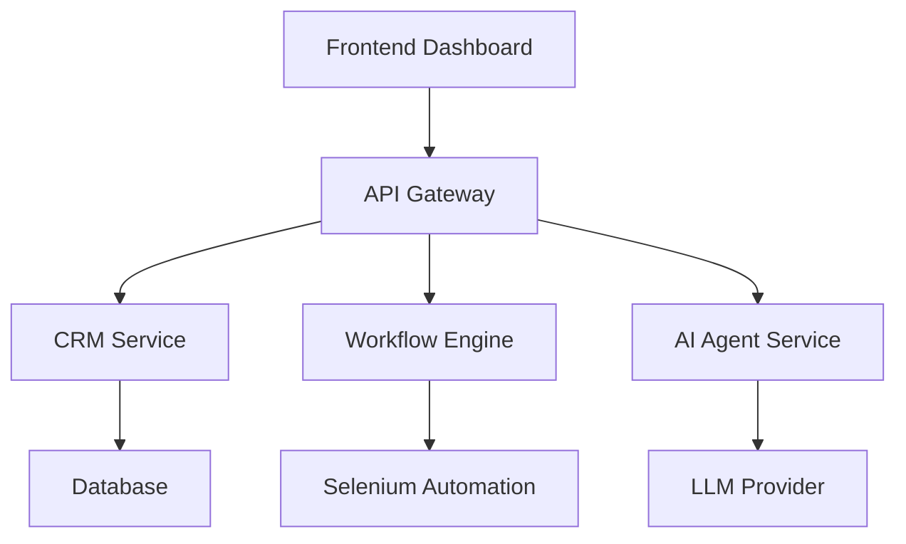

# System Overview

The Clow platform is composed of modular services that automate CRM operations and AI workflows.

## Core Components

- Frontend Dashboard
- Workflow Engine
- AI Agent Services
- CRM Services
- Notification System
- Selenium Automation

